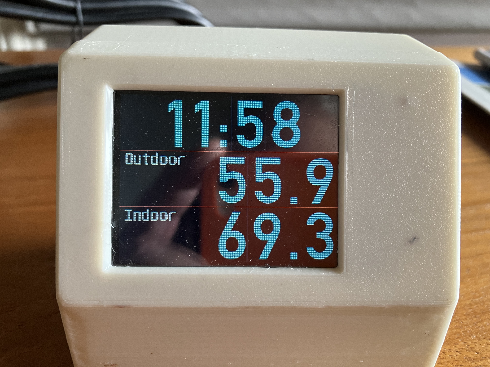
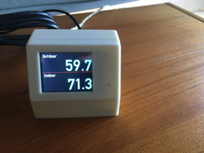

# weather_station

A Micropython project to create a simple temperature display using two BMP280 sensors. One to 
display the indoor temperature and one for the outdoor.

This version is set up for the Raspberry Pi Pico W with wireless connection. Currently only uses
the wireless connection to get the current time from a ntp service. The idea is to display the time
as well as the temperate. 

It works with either the Pico W or the original Pico and should work with most MicroPython builds.

In the case where the device does not have Wifi or Wifi is not available it defaults to a display
of just the indoor and outdoor temperatures.

## Hardware:

### Processor: Raspberry Pi Pico W or Pico without WiFi

### I2C Temperature sensors: 

The BMP setup uses two sensor devices connect via I2C. I'm making use of the 2 hardware I2C channels
to get around the fact that the units I have have a fixed address of 118 digital. 

### iLi9341 Display driver

The display is a 240 X 320px TFT display connected via the SPI bus.

## Display Images:

The digits that are the primary display elements are rendered from image file rather than TFT fonts though
some label and startup text is displayed using the Unispace12x24.c font file.

For use with the display the images created in png format need to be converted to the .raw format using the
python script img2rgb565.py.

## Proof it worked...

With time:

Without time:

